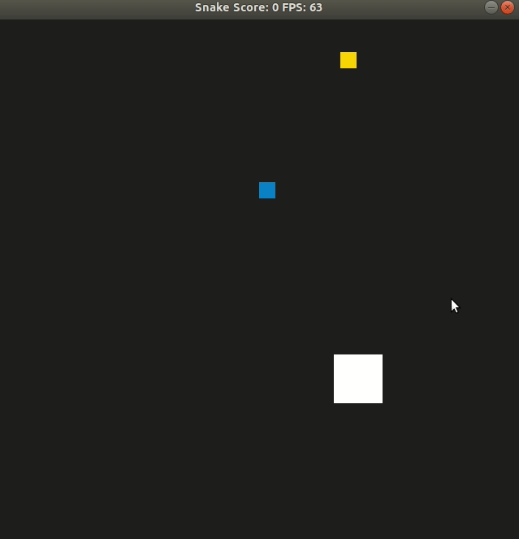

# CPPND: Capstone Project Snake Game with added features

This is the Capstone project in the [Udacity C++ Nanodegree Program](https://www.udacity.com/course/c-plus-plus-nanodegree--nd213). The code for this repo was inspired by [this](https://codereview.stackexchange.com/questions/212296/snake-game-in-c-with-sdl) excellent StackOverflow post and set of responses.

## Project Description

In this project, additional features are added to the original snake game, making it a bit more challenging. The player now has to eat food while avoiding a autonomously moving and bouncing obstacle squre, which grows and changes behaviour patterns every time the snake eats food. To dial down the difficulty, every 10 times snake eats food, the obstacle will shrink back to default size. Additionally, every time the snake's head bumps into the obstacle, the snake will be cut in half (just for fun). If the snake does not own any body part when hit by obstacle, it will die. Hit at snake's body does not cause damage. 

The project was built based on the origianl snake game, with various modifications on Game, Renderer and Snake classes. The Controller class was not changed. One additional class was added, namely the Obstacle class which interact with the screen and snake instance, while new game mechanisms are added to Game and renderer classes. 

A simple gif showing the game running:

## Dependencies for Running Locally (same as original Repo from [Udacity CppND-Capstone-Snake-Game](https://github.com/udacity/CppND-Capstone-Snake-Game))
* cmake >= 3.7
  * All OSes: [click here for installation instructions](https://cmake.org/install/)
* make >= 4.1 (Linux, Mac), 3.81 (Windows)
  * Linux: make is installed by default on most Linux distros
  * Mac: [install Xcode command line tools to get make](https://developer.apple.com/xcode/features/)
  * Windows: [Click here for installation instructions](http://gnuwin32.sourceforge.net/packages/make.htm)
* SDL2 >= 2.0
  * All installation instructions can be found [here](https://wiki.libsdl.org/Installation)
  >Note that for Linux, an `apt` or `apt-get` installation is preferred to building from source. 
* gcc/g++ >= 5.4
  * Linux: gcc / g++ is installed by default on most Linux distros
  * Mac: same deal as make - [install Xcode command line tools](https://developer.apple.com/xcode/features/)
  * Windows: recommend using [MinGW](http://www.mingw.org/)

## Basic Build Instructions

1. Clone this repo.
2. Make a build directory in the top level directory: `mkdir build && cd build`
3. Compile: `cmake .. && make`
4. Run it: `./SnakeGame`.
5. No additional libraries are required other than specified above.

## Rubric points that are addressed in this project

1. The project demonstrates an understanding of C++ functions and control structures. if/else control and switch are implemented to check boundary collisions, the functions are organised. Such as in obstacle.cpp, Obstacle::bounce(int) and Obstacle::move(Snake &), lines from 25-89:
<image src="img/switch.png"/>
<image src="img/ifelse.png"/>

2. The project uses Object Oriented Programming techniques.This project has added class Obstacle, defined in obstacle.cpp and obstacle.h.

4. Classes use appropriate access specifiers for class members. As shown in obstacle.h from line 9 to line 64, classifiers are clearly identified.

6. Class constructors utilize member initialization lists. As shown in obstacle.cpp line 6-19.
<image src="img/listinit.png"/>

8. Classes abstract implementation details from their interfaces.
9. Classes encapsulate behavior.
10. Overloaded functions allow the same function to operate on different parameters.
11. The project makes use of references in function declarations.

